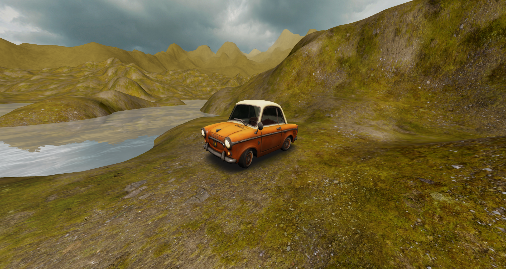

# CS 343 - Project

Live demo: [ethanheuer.github.io/cs343-project/public/](https://ethanheuer.github.io/cs343-project/public/)

## About

This project is a simple demo of height map rendering in WebGL using Three.js. The environment features low-res and high-res terrain, real-time water simulation, a model with basic material properties, and a skybox.

## Objective

The objective of this project was to clone Project 3 into Three.js. This included loading a height map from an image and rendering low and high LOD terrain. I also planned on cloning the

## Optimizations

I used three main optimizations to improve performance: a cell manager, performance options, and material reuse.

The cell managers cell size and radius (cells away from center) can be adjusted. Overall, having larger cells and a smaller radius will improve performance. If the radius is larger, regardless of cell size, more cells will be created which degrades performance.

Performance options include anti-aliasing, power preference, and precision. These are all options used in the Three.js renderer. None of these options improved performance in any noticeable way. Anti-aliasing being disabled did improve FPS by about 5-10 frames under specific conditions. On mobile, changing precision to low slightly increased FPS, but caused a very noticeable decrease in quality (jagged and blocky edges).

Material reuse was the most effective optimization. Instead of defining a new material for each cell, I reused the same material for all cells. This significantly improved performance when generating and rendering cells.

## Assets

- Skybox: [Cloudy Skyboxes by Spiney](https://opengameart.org/content/cloudy-skyboxes)
- Car Model: [Pony Cartoon by Slava Z.](https://sketchfab.com/3d-models/pony-cartoon-885d9f60b3a9429bb4077cfac5653cf9)
- Water: [Three.js](https://github.com/mrdoob/three.js/tree/master/examples/textures)
